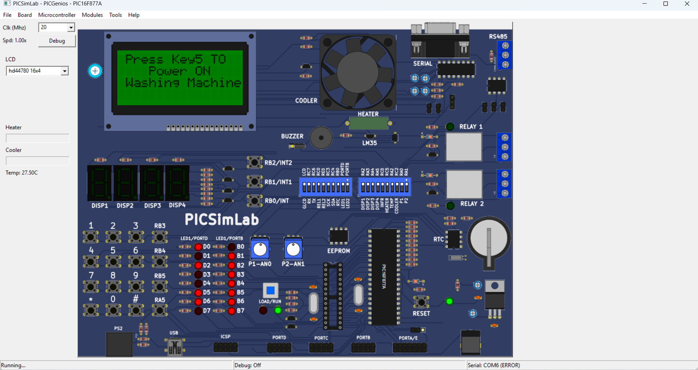

# Embedded C Washing Machine Simulation

An Embedded C-based automatic washing machine simulation developed using the **PIC16F877A microcontroller** and tested in **PICSimLab using the PICGenios board**. The project demonstrates modular firmware development, keypad interfacing, LCD control, timer-based operation, interrupt handling, and peripheral control.



## Overview

This project simulates the operation of an automatic washing machine using **Embedded C**.

The user interacts with the system through a **4x3 keypad**, while a **16x4 HD44780 LCD** provides prompts and status information. The PIC16F877A processes user inputs and controls the washing-machine operations using programmed control logic, timers, interrupts, and peripheral outputs.

The firmware is organized into multiple modules for hardware drivers, timer configuration, interrupt handling, and washing-machine control logic.

## Features

* Keypad-based user input
* Power-on control using **Key5**
* 16x4 LCD status and user prompts
* Timer2-based timing
* Timer interrupt handling
* Buzzer control
* Fan control
* LED status indication
* Modular Embedded C firmware
* State-based control logic

## Technologies Used

* **Programming Language:** Embedded C
* **Microcontroller:** PIC16F877A
* **Clock Frequency:** 20 MHz
* **IDE:** MPLAB X IDE
* **Simulation:** PICSimLab
* **Simulation Board:** PICGenios

## Hardware / Peripherals

* PIC16F877A Microcontroller
* 16x4 HD44780 Character LCD
* 4x3 Digital Keypad
* Buzzer
* Fan
* LEDs

## How It Works

When the simulation starts, the LCD displays:

> **Press Key5 TO Power ON Washing Machine**

The user presses **Key5** on the keypad to power on the washing machine.

After power-on, the keypad is used to interact with the washing-machine control system. The PIC16F877A processes the user input and controls the programmed operations.

**Timer2 and interrupts** are used for time-based control, while the LCD and LEDs provide status information. The buzzer and fan are controlled by the microcontroller according to the programmed logic.

### System Flow

```text
        4x3 Keypad
             |
             v
      +--------------+
      |  PIC16F877A  |
      | Control Logic|
      +--------------+
        |    |    |
        |    |    +------> Buzzer
        |    |
        |    +-----------> Fan
        |
        +---------------> LCD
        |
        +---------------> LEDs
             
       Timer2 + ISR
             |
             v
      Time-based Control
```

## Firmware Modules

The project is divided into multiple modules for better code organization and maintainability.

| File                             | Description                                  |
| -------------------------------- | -------------------------------------------- |
| `main.c`                         | Main program and system initialization       |
| `main.h`                         | Main program definitions and declarations    |
| `clcd.c`                         | 16x4 LCD driver implementation               |
| `clcd.h`                         | LCD driver declarations                      |
| `digital_keypad.c`               | Keypad scanning and input handling           |
| `digital_keypad.h`               | Keypad definitions and declarations          |
| `timers.c`                       | Timer2 configuration                         |
| `timers.h`                       | Timer-related declarations                   |
| `isr.c`                          | Interrupt Service Routine                    |
| `washing_machine_function_def.c` | Washing machine control and operation logic  |
| `washing_machine_header.h`       | Washing machine declarations and definitions |
| `Makefile`                       | Project build configuration                  |

## Embedded Systems Concepts Demonstrated

* Embedded C programming
* PIC16F877A microcontroller programming
* GPIO configuration
* Digital input/output
* Keypad interfacing
* Character LCD interfacing
* Timer configuration
* Timer2 interrupt-based timing
* Interrupt Service Routine (ISR)
* Peripheral control
* Modular firmware architecture
* State-based control logic

## Simulation Environment

The project was developed using **MPLAB X IDE** and simulated using **PICSimLab with the PICGenios board**.

The PIC16F877A is configured to operate at **20 MHz**.

## How to Run

1. Open the project in **MPLAB X IDE**.
2. Build the project to generate the `.hex` file.
3. Open **PICSimLab**.
4. Select the **PICGenios board** with the PIC16F877A.
5. Load the generated `.hex` file into the simulation.
6. Start the simulation.
7. Press **Key5** to power on the washing machine.
8. Use the keypad to interact with the system.

## Project Structure

```text
Embedded-C-Washing-Machine-Simulation/
│
├── README.md
├── main.c
├── main.h
├── clcd.c
├── clcd.h
├── digital_keypad.c
├── digital_keypad.h
├── timers.c
├── timers.h
├── isr.c
├── washing_machine_function_def.c
├── washing_machine_header.h
├── Makefile
│
└── images/
    └── washing_machine_simulation.png
```

## Author

**Abhishek Biradar**

B.E. Electronics & Communication Engineering

**Embedded Systems | Firmware Development | Robotics | IoT**
